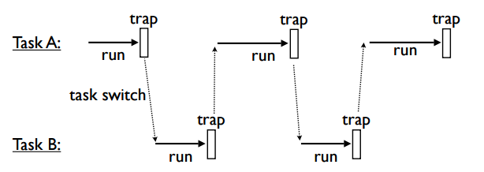

### 1. Introduction to Generators and Coroutines
* Generators 提供数据给迭代器, Coroutines 消费数据.

### 2. Coroutines, Pipelines, and Dataflow
*  Coroutines可以用于建立管道, 把各个coroutines串联起来,用send传输数据.
   数据源(cource)驱动整个管道, 管道也必须有个终点(sink).
   |source| -->send() |coroutine| -->send() |coroutine| -->send() |sink|
   input sequence --> |generator| --> |generator| --> |generator| -> for x in s:
*  Key Different:
  __Generators pull data through the pipe with iteration.__
  __Coroutines push data into the pipelien with send.__

    ```
    def source(target):
        while not done:
            item = produce_an_item()
            ...
            target.send(item)
            ...
        target.close()
    
    @coroutine                      # Call next() before using
    def sink():
        try:
            while True:
                item = (yield)      # Receive an item
                ...
        except GeneratorExit:       # Handle .close()
            # Done
            ...
    
    @coroutine
    def filter(target):
        while True:
            item = (yield)          # Receive an item
            # Transform/filter item
            ...
            # Send it along to the next stage
            target.send(item)

    ```
* Coroutines可以给多个目标传输数据, 更加灵活数据路径可能.
               |--> |coroutine0|
   |coroutine| |--> |coroutine1|  --> |coroutine|
               |--> |coroutine2| 

### 3. Coroutines and Event Dispatching
* Coroutines可以用于处理事件流的组件(components).
* Coroutines方式, 数据源可以尽可能low-level, 而不必重写数据处理的其他阶段.

### 4. From Data Processing to Concurrent Programming
* 对于线程间通过队列(queues)传输数据.
* 对于进程间通过管道(pipe)或socket传输数据.
* Coroutines中send方法必须是同步的.(Example:多线程send数据给同一个目标Coroutine)[cocrash]()
* Coroutines 之间不能有环(loops or cycles)
* Stacked sends will build up a kind of call-stack, because send() doesn't return until the target yields.(?)

### 5. Coroutines as Tasks
* Tasks have a few essential features
    * Independent control flow
    * Internal state
    * Can be scheduled
    * Can communicate with other tasks

### 6. A Crash Course in Operating Systems
* Cpus Don't know anything about multitasking, it only run a series of instructions.
* The operating system is responsible for runing programs on your machine. It allow to run multiple programs by rapidly switching between tasks.
* Two Mechanisms that an operating system uses to gain control:
    * Interrupts - Some kind of hardware related signal(data received, timer, keypress etc).
    * Trap - A sofeware generated signal
        * Low-level system calls are actually traps.
* Program and OS Flow:
    * The OS drops your program on the CPU.
    * It runs until it hits a trap(system call).
    * The program suspends and the OS runs.
    * Repeat.
* Tasks Switching:

* The yield statement is a kind of "trap". if you treat yield as a trap, you can build a multitasking 'OS'.

### 7. Let's build on Operation System
* In OS, traps is system calls.
* In our code, the scheduler is the os, the statement yield is a trap.
* To request the service of the scheduler, tasks will use yield statement with a value
* Desgin:
    * Tasks do not see scheduler.
    * Tasks do not see other tasks.
    * yield is the only external interface.

### 8. The Problem with the stack
* When working with coroutines, you can't write subroutine functions that yield(suspend).
